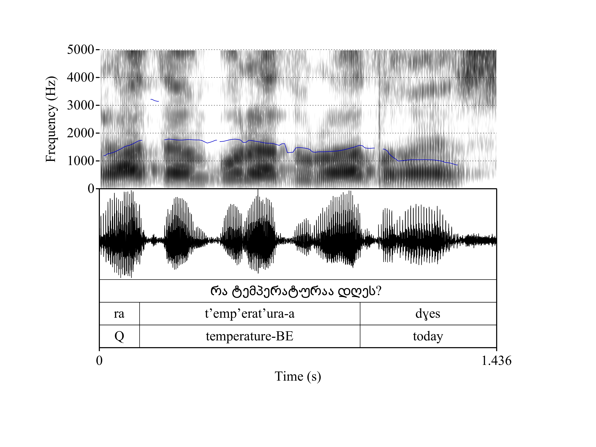
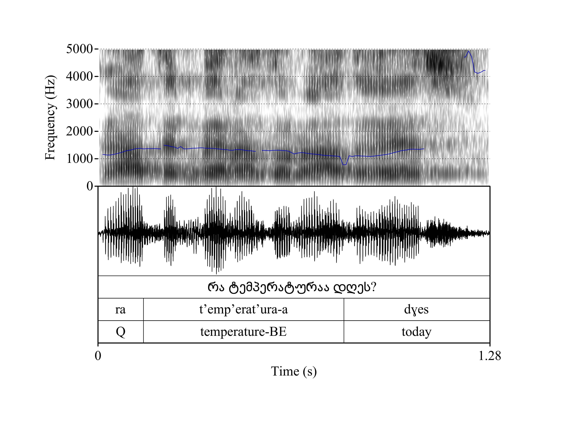

# Exploring Phonetic Variation in Low-Resource Languages Using Large-Scale Data Collection: A Preliminary Look at Georgian Prosody


## Background

As technologies such as smartphones reach remote areas, the need for
developing language technologies for smaller speaker populations has
become more pressing. In this paper, we present methodology for low resource
language documentation, and exemplify the usefulness of such techniques with a
phonetic study of prosodic variability in Georgian, a Kartvelian agglutinative
language spoken in the Caucasus Mountains on the border of Eastern Europe and
Western Asia. Used by 1.4 million speakers in the Republic of Georgia (Figure
1.) and members of the diaspora throughout the world, Georgian is an
understudied language with very limited access to software and tools (e.g. spell
checkers, electronic dictionaries and search engine tokenizers) which would
facilitate its use in written form. While Georgian is the national language of
Georgia, most computer systems sold in Georgia are offered in Russian or in
English \cite{Sh}, and because most search engines lack support for Georgian,
users perform internet searches using Russian or English keywords.


## Methodology

In 2014 we created open source libraries and tools to facilitate usage of the
Georgian language by Georgian speakers \cite{Du}. One of these tools was Gismet,
an Android application which can be used by Georgian speakers to train their
Android smartphones to recognize their speech using PocketSphinx \cite{Hu}. The
software was made freely available to the public and also open source on GitHub,
a social coding site where developers can share and contribute to the source
code.

Participants discover the application in the Google Play Store. After installing
it, they are led through a tutorial where they record 2-6 utterances to train
the application to their voice. The stimuli consist of two SMS dictations, two
web searches and two legal searches. Following the training phase, users can add
additional training sentences or begin using the application anywhere in the
Android system where keyboard input is provided. The training utterances are
uploaded to a central server where they are processed using Praat \cite{Bo} and
the CMUSphinx language model toolkit \cite{Wa}. The stimuli are comprised of six
utterances which were elicited during fieldwork with three speakers in Batumi,
Georgia in 2014.


## Data

Since 2014, over 1,000 users have used the application to train the default
language model to their voices. The resulting dataset of elicited
training recordings is similar to a dataset obtained in an experimental setting.
The location of the recordings is determined via GPS technology, and informed
consent for the anonymous analysis of their voices is required as part of the
software installation process. This set-up enables us to conduct
studies regarding various aspects of their speech production. Georgian has numerous
 and diverse dialects, the phonetic variation in
the contemporaneous form of the language has not been studied, with very few
exceptions \cite{Ch, CGB}.  For a first `case study' based on our corpus, we
have selected prosodic variation, specifically the realization of syllable timing
patterns in short utterances. The prosodic properties of Georgian are of
particular interest, given the ability of its consonants to form extensive
clusters \cite{Ch} combined with vowel reduction \cite{Bu}.
While the analysis of the entire corpus is underway, Figure 2. presents
spectrograms of two speakers' production of the same short question ``What is
the temperature today?,'' with distinct prosodies.


## Figures

Map of Georgia ([source](https://www.arcgis.com/home/webmap/viewer.html?webmap=538fc5649e2c463eb32fa1ce3fdfb51f))


Figure A: Specrogram of "რა ტემპერატურაა დღეს?" with careful yet natural prosody




Figure B: Specrogram of "რა ტემპერატურაა დღეს?" with audience-less prosody




## References

```
@InProceedings{dunham-chiodo-horner:2014:W14-22,
  author    = {Dunham, Joel  and  Chiodo, Gina  and  Horner, Joshua},
  title     = {LingSync \& the Online Linguistic Database: New Models for the Collection and Management of Data for Language Communities, Linguists and Language Learners},
  booktitle = {Proceedings of the 2014 Workshop on the Use of Computational Methods in the Study of Endangered Languages},
  month     = {June},
  year      = {2014},
  address   = {Baltimore, Maryland, USA},
  publisher = {Association for Computational Linguistics},
  pages     = {24--33},
  url       = {http://www.aclweb.org/anthology/W14-2204}
}


@article{SHEROUSE20141,
  title = "Hazardous digits: Telephone keypads and Russian numbers in Tbilisi, Georgia",
  journal = "Language & Communication",
  volume = "37",
  number = "Supplement C",
  pages = "1 - 11",
  year = "2014",
  issn = "0271-5309",
  doi = "https://doi.org/10.1016/j.langcom.2014.03.001",
  url = "http://www.sciencedirect.com/science/article/pii/S0271530914000172",
  author = "Perry Sherouse",
  keywords = "Sociotechnical system, Telephone, Language ideology, Numeral system, Numbers"
}

@incollection{juhar2012recent,
  title={Recent progress in development of language model for Slovak large vocabulary continuous speech recognition},
  author={Juh{\'a}r, Jozef and Sta{\v{s}}, J{\'a}n and Hl{\'a}dek, Daniel},
  booktitle={New technologies-trends, innovations and research},
  year={2012},
  publisher={InTech}
}

@article{walker2004sphinx,
  title={Sphinx-4: A flexible open source framework for speech recognition},
  author={Walker, Willie and Lamere, Paul and Kwok, Philip and Raj, Bhiksha and Singh, Rita and Gouvea, Evandro and Wolf, Peter and Woelfel, Joe},
  year={2004},
  publisher={Sun Microsystems, Inc.}
}

@INPROCEEDINGS{Huggins-daines06pocketsphinx:a,
    author = {David Huggins-Daines and Mohit Kumar and Arthur Chan and Alan W Black and Mosur Ravishankar and Alex I. Rudnicky},
    title = {PocketSphinx: A free, real-time continuous speech recognition system for hand-held devices},
    booktitle = {in Proceedings of ICASSP},
    year = {2006}
}

```

TODO

* Ioana Chitoran georgian clusters


## Links

### Georgia maps

* https://www.arcgis.com/home/item.html?id=ec63e68fcf304c639859ebbc29d0a0f0
* https://www.arcgis.com/home/item.html?id=538fc5649e2c463eb32fa1ce3fdfb51f
* https://www.arcgis.com/home/item.html?id=7e9476ac913b481baf4d44fc5468cf97
* https://www.arcgis.com/home/webmap/viewer.html?webmap=1adf3a2d0a434e60b4c64ff4fe74e48b
* https://www.arcgis.com/home/item.html?id=ad7c8f1a0a3e465884d58f1a5309d191


### World map

* https://services.arcgisonline.com/arcgis/rest/services/Canvas/World_Dark_Gray_Reference/MapServer


### D3 maps

* https://github.com/d3/d3-geo/blob/master/README.md#projections
* http://maptimeboston.github.io/d3-maptime/#/86


Georgian SMS

http://www.sciencedirect.com/science/article/pii/S0271530914000172

